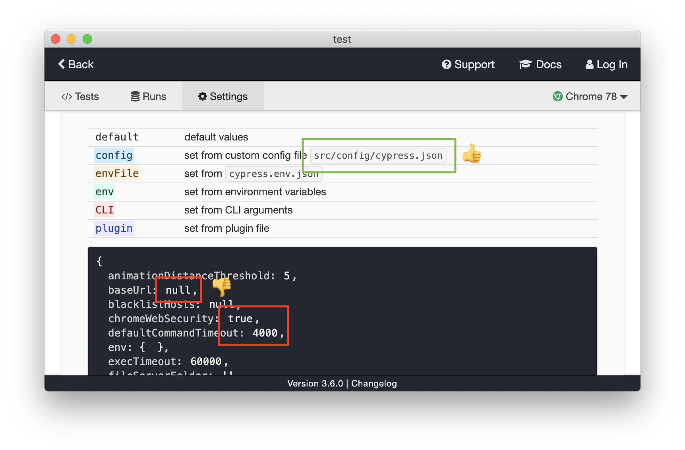
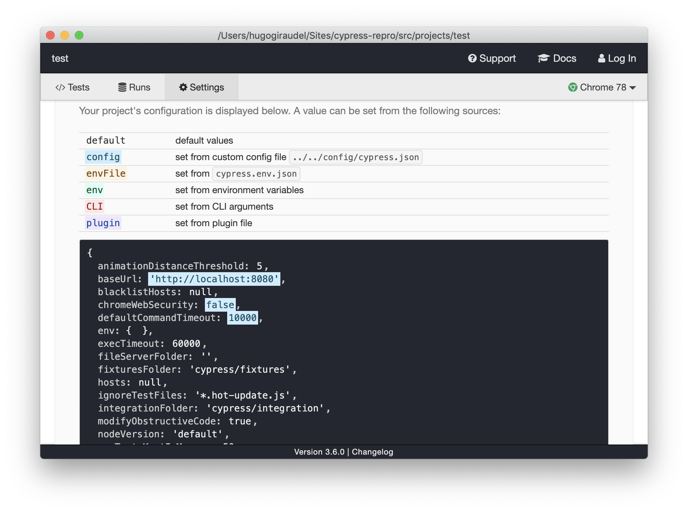

# Cypress #5570 — Issue reproduction

1. Install `node_modules` at the root of the project.

```sh
npm install
```

2. Open the Cypress app from the root of the project (with the `--global` option), with the configuration file located at `src/config/cypress.json` (with the `--config-file` option).

```sh
$(npm bin)/cypress open --config-file src/config/cypress.json --global
```

3. In the Cypress app, locate the `test` project and open it.


4. Check the “Settings” tab, and notice while the path to the configuration file is correctly displayed (`src/config/cypress.json`), **its content is not loaded**.



5. To confirm that the `--global` option is the problem, run the same command without the flag (and with adjusted path to configuration) from within the project folder (`src/projects/test`).

```sh
cd src/projects/test
$(npm bin)/cypress open --config-file ../../config/cypress.json
```

Then notice the configuration is properly loaded:


